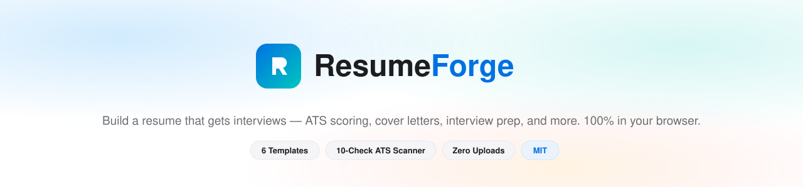
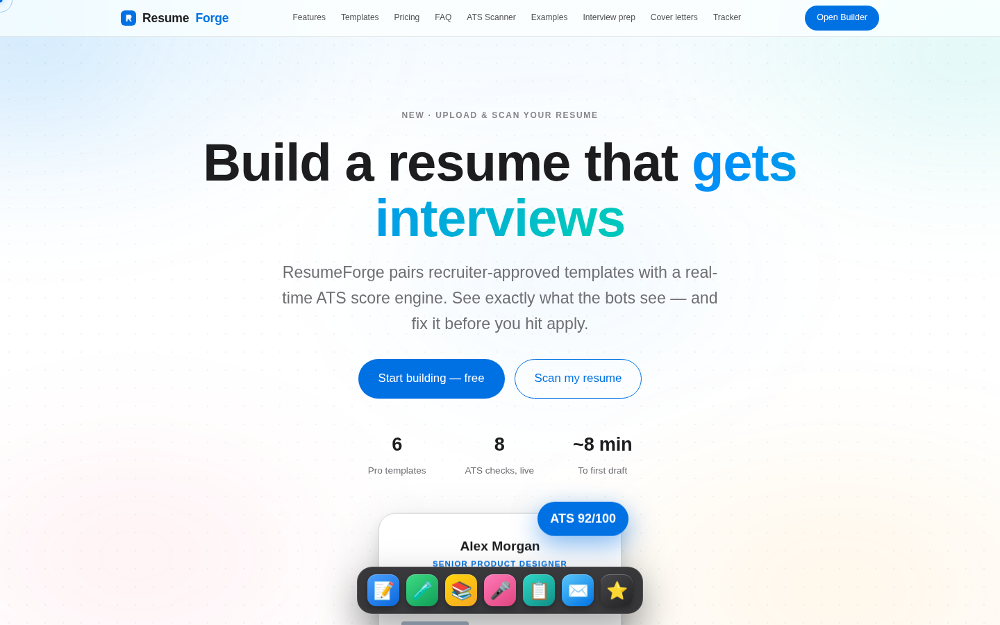
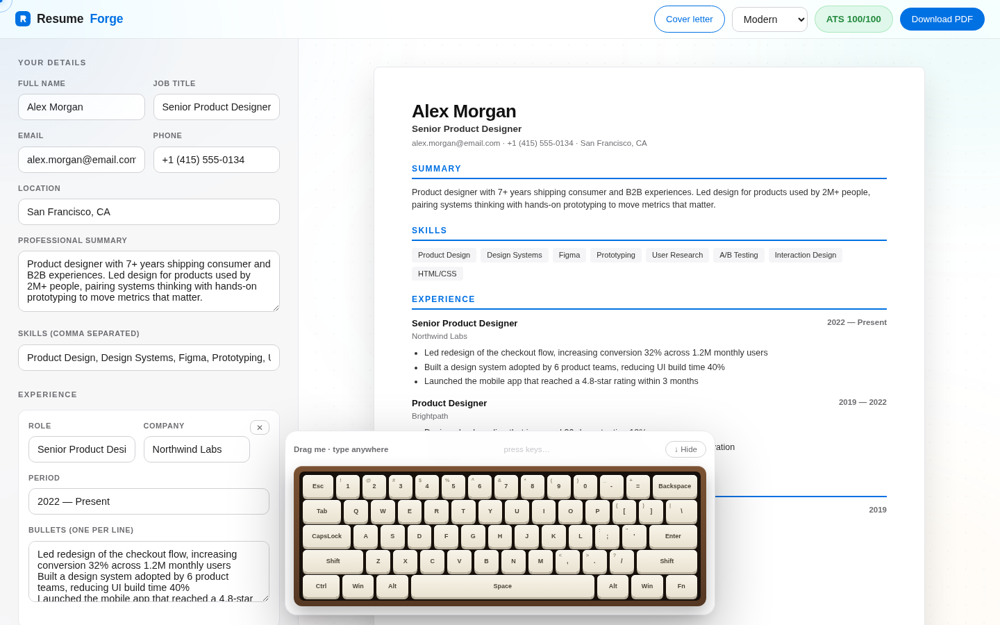
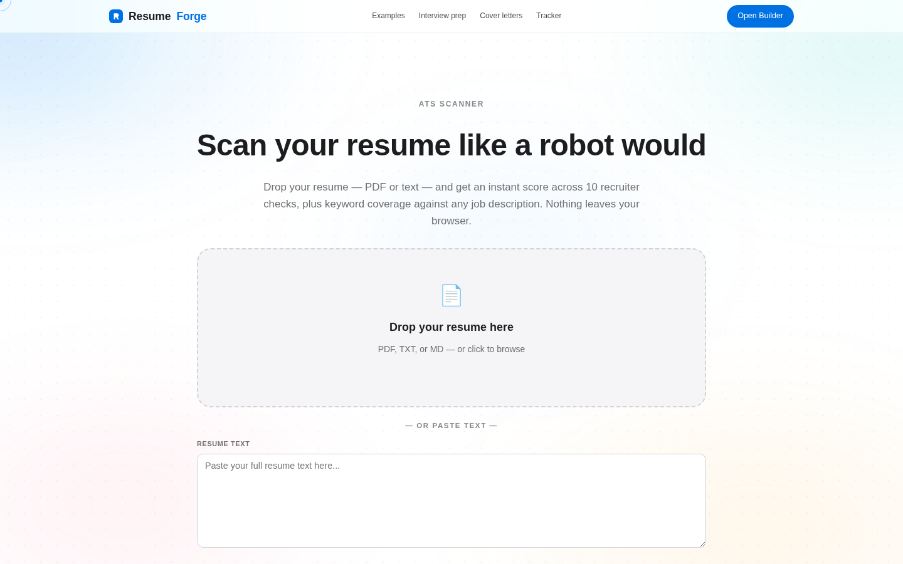
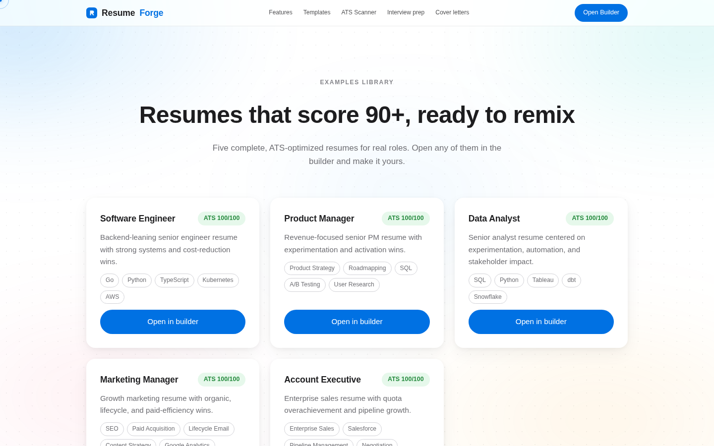
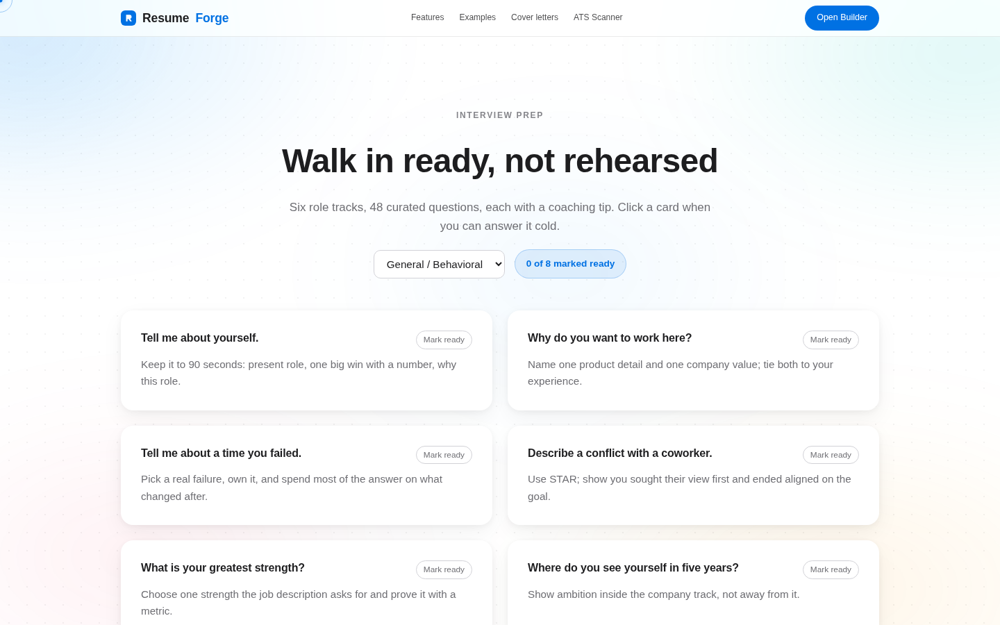
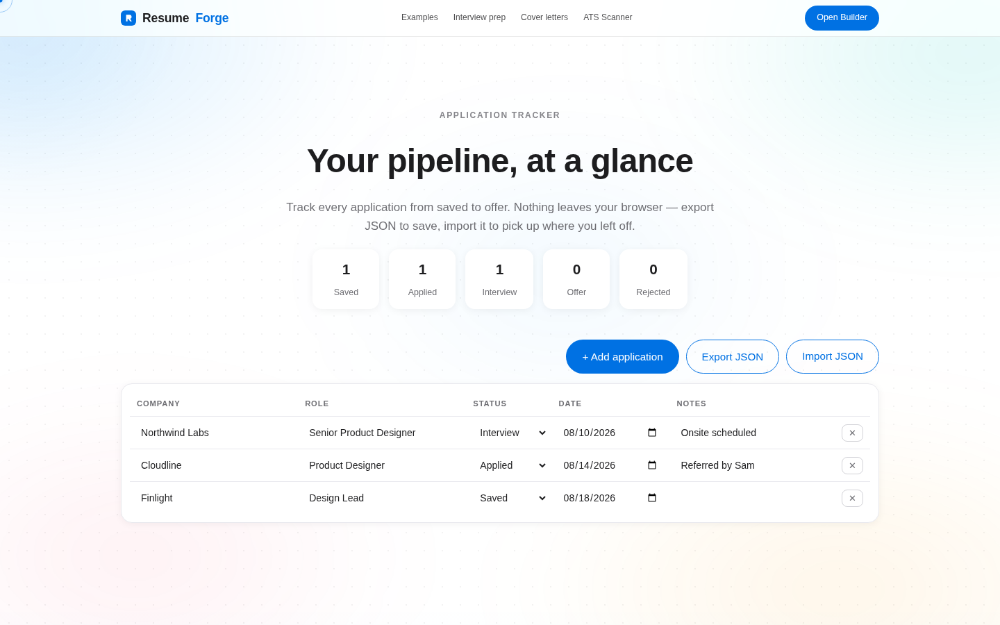
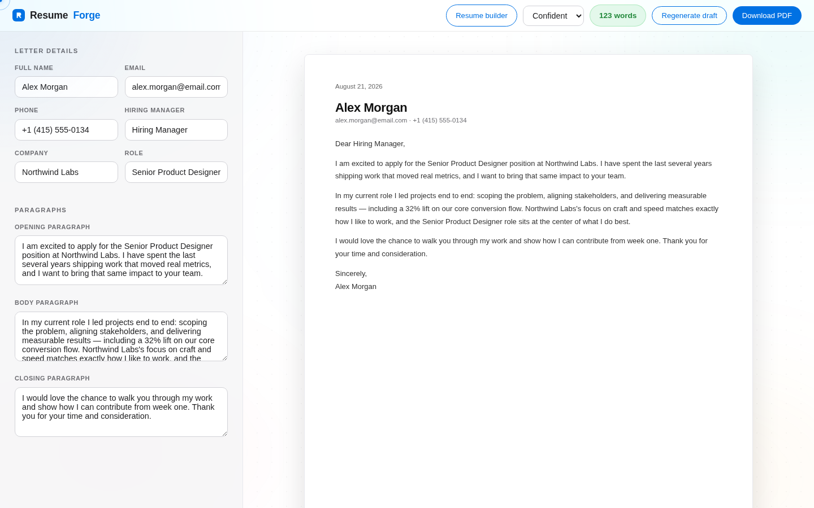
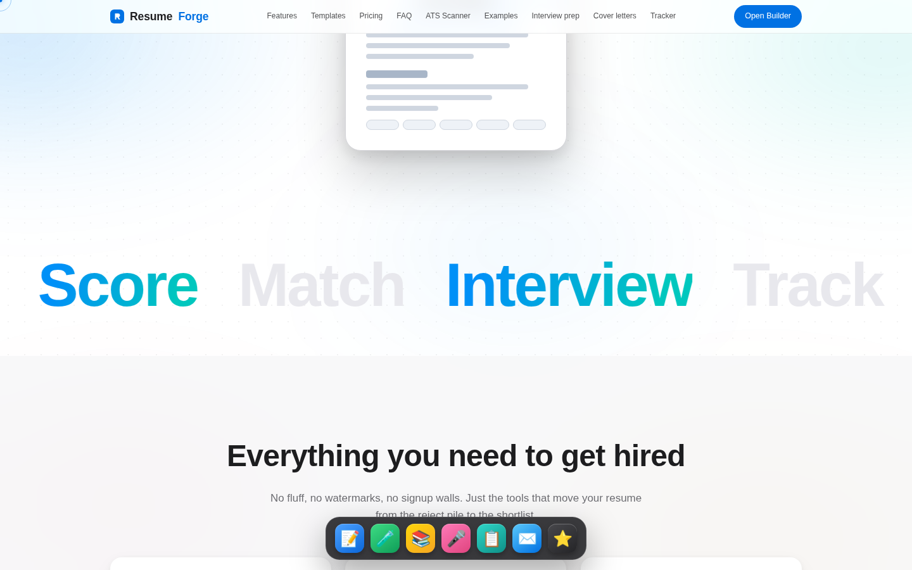
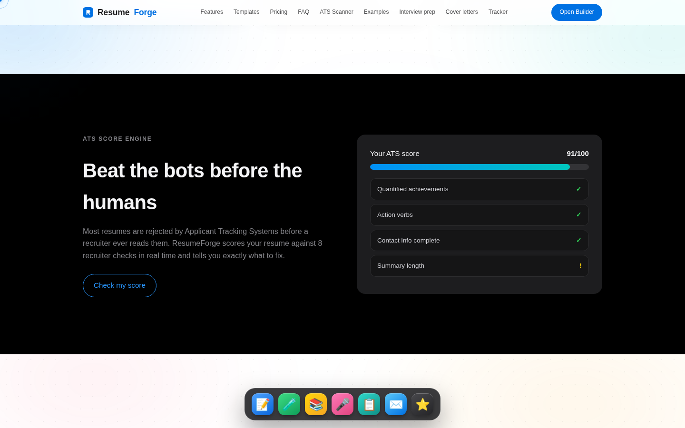

<div align="center">



[](https://resumeforge-ruby-rho.vercel.app)


**The complete, privacy-first career toolkit.** Build, score, and export a resume · scan any PDF against ATS checks · match job descriptions · write cover letters · prep interviews · track applications. All of it runs entirely in your browser — nothing is ever uploaded.



</div>

---

## Table of Contents

- [Live Demo](https://resumeforge-ruby-rho.vercel.app)
- [About](#about)
- [Pages & Features](#pages--features)
- [Interactive Playground](#interactive-playground)
- [The Scoring Engines](#the-scoring-engines)
- [Architecture](#architecture)
- [Getting Started](#getting-started)
- [Testing](#testing)
- [Design System](#design-system)
- [Roadmap](#roadmap)
- [License](#license)

---

## About

ResumeForge is a monetization-ready career product (Free / Pro $9mo / Lifetime $49 tiers) that covers the entire job-application loop in one place:

| Area | What you get |
| --- | --- |
| **Build** | Live resume builder, 6 recruiter-approved templates, one-click PDF |
| **Score** | 8-check real-time ATS engine + 10-check full-text scanner with PDF upload |
| **Match** | Job-description keyword matcher with live coverage % |
| **Write** | Cover letter studio with 3 tone presets |
| **Prep** | 48 curated interview questions across 6 role tracks |
| **Track** | Application pipeline tracker with JSON export/import |

Everything is client-side: no accounts, no tracking, no servers touching your career data.

---

## Pages & Features

### Resume Builder — with a real mechanical keyboard

Live preview across six templates, ATS re-scored on every keystroke, per-bullet **Bullet Doctor**, JD keyword matching — plus a draggable, throwable mechanical keyboard that physically presses as you type. Toss it away with an animation and recall it from the corner **⌨** key.



### ATS Scanner — upload & score

Drop a PDF/TXT resume (or paste text) for an animated score ring, 10 weighted checks, document stats, and optional JD keyword coverage. PDF text extraction runs locally via vendored pdf.js.



### The rest of the toolkit

| | |
| --- | --- |
|  **Examples Library** — 5 complete role resumes, all scoring 100/100, one-click open in the builder |  **Interview Prep** — 48 questions across 6 role tracks with coaching tips and a readiness counter |
|  **Application Tracker** — pipeline stages, inline editing, JSON export/import |  **Cover Letter Studio** — 3 tone presets, live preview, word-count meter, PDF export |

---

## Interactive Playground

The site is alive end to end — all powered by locally vendored GSAP + ScrollTrigger:



- **macOS-style dock** — bottom-pinned app dock with cursor-proximity magnification (each icon claims its own space as it grows) and tooltips
- **Mechanical keyboard** — 60% layout, cream keycaps on a wooden deck; mirrors your real keystrokes, shows live key combos, drags with comfy lag-and-tilt physics, throws with inertia, and leaps into the corner when hidden
- **Giant marquee ribbons** — two infinite scrolling bands of 6rem type with gradient words, running opposite directions
- **ScrollTrigger choreography** — word-by-word headline reveals, count-up hero stats, and an ATS meter that fills 0→92% exactly when you reach it
- **3D tilt + glare cards** — feature/template/testimonial tiles tilt toward the cursor with a moving light sweep
- **Cursor system** — blue dot + trailing ring that expands over anything interactive, plus a soft light-field following the mouse
- **Magnifying social pill** — dock-style magnification on the footer's circular icon buttons



Everything respects `prefers-reduced-motion` and disables cleanly on touch devices.

---

## The Scoring Engines

Three pure, node-testable modules (no DOM):

**Builder engine — `js/ats.js` · 8 checks · 100 pts**

| Check | Pts | Check | Pts |
| --- | --- | --- | --- |
| Contact info complete | 10 | Quantified achievements | 15 |
| Strong summary (60–500 chars) | 15 | Action verbs (3+) | 10 |
| 6+ relevant skills | 15 | Education listed | 10 |
| 2+ experience entries | 20 | Location provided | 5 |

**Scanner engine — `js/parse.js` · 10 checks · 100 pts** — contact (15), experience/education/skills sections (10 each), summary (5), quantified achievements (15), action verbs (10), healthy length (10), bullet formatting (10), minimal first-person pronouns (5).

**Keyword matcher — `js/match.js`** — extracts the top 18 JD terms through a stop-word filter and reports matched vs. missing with a coverage %.

---

## Architecture

Pure **HTML + CSS + vanilla JS**. No frameworks, no build step, no runtime CDN calls — GSAP, ScrollTrigger, pdf.js, and all fonts are vendored locally.

```
resumeforge/
├── index.html            # Landing: hero, marquees, dock, pricing, FAQ
├── builder.html          # Builder + ATS + JD match + bullet doctor + keyboard
├── scan.html             # Upload/paste ATS scanner
├── examples.html         # 5 role resumes
├── interview.html        # 48-question prep studio
├── tracker.html          # Application pipeline
├── coverletter.html      # Cover letter studio
├── css/                  # Apple-language design system (per-page files)
├── js/
│   ├── ats.js            # 8-check structured scorer        (pure)
│   ├── parse.js          # 10-check raw-text scorer         (pure)
│   ├── match.js          # JD keyword matcher               (pure)
│   ├── bulletlib.js      # Per-bullet analyzer              (pure)
│   ├── coverlib.js       # Tone-based letter generator      (pure)
│   ├── examples.js       # 5 role resumes                   (data)
│   ├── questions.js      # 48 interview questions           (data)
│   ├── fx.js             # Cursor system + magnetic buttons
│   ├── motion.js         # ScrollTrigger choreography + tilt cards
│   ├── dock.js           # macOS dock + social pill
│   ├── keyboard.js       # Mechanical keyboard + physics
│   └── …page controllers
├── vendor/               # gsap, ScrollTrigger, pdf.js, fonts (self-hosted)
├── tests/
│   ├── logic.test.js     # 45+ assertions over every pure module
│   └── e2e.js            # 15-check Playwright suite, all 7 pages
└── docs/                 # README assets
```

---

## Getting Started

```bash
git clone https://github.com/Rahul777111/resumeforge.git
cd resumeforge
python3 -m http.server 8080     # any static server works
# open http://localhost:8080
```

No install. No build. No environment variables.

---

## Testing

```bash
node tests/logic.test.js   # pure-logic suite: engines, matcher, doctor, data integrity
node tests/e2e.js          # Playwright: 15 assertions across all pages (server on :8043)
```

Both suites are green on `main`.

---

## Design System

Apple design language, extracted from live reference study of apple.com:

- SF Pro system stack · tight-tracked display headlines · gray subheads (#6e6e73)
- Frosted 52px nav · solid #0071e3 pill CTAs · outlined secondary pills
- Alternating white / #f5f5f7 / pure-black full-bleed sections
- Abstract living background: drifting mesh-gradient blobs + dot-grid texture, glowing through frosted sections
- White tiles with layered soft shadows · divider-line FAQ accordions

---

## Roadmap

- Salary negotiation toolkit
- Resume text importer (paste → structured fields)
- Custom template accent colors
- Cover letter A/B variants

---

## License

Released under the [MIT License](LICENSE).

<div align="center">


**ResumeForge** — crafted for job seekers.

</div>
